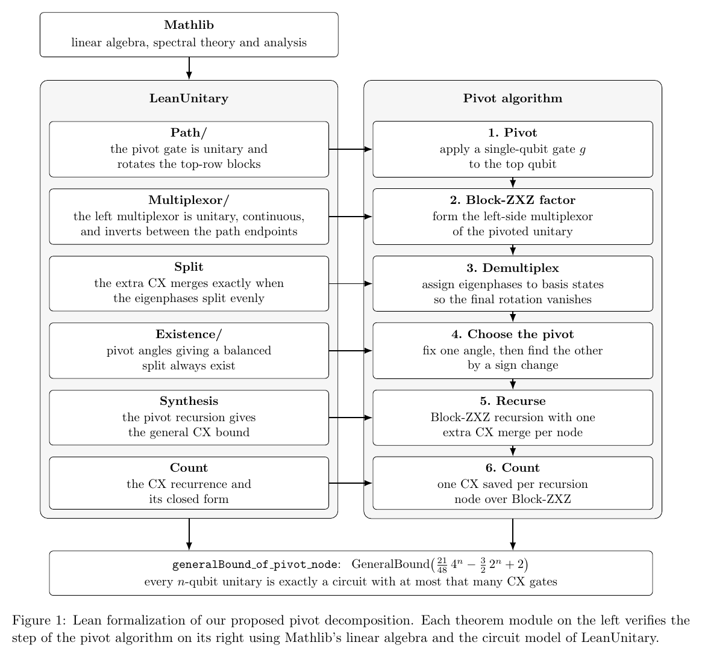

# lean-unitary

Machine-checked synthesis of arbitrary `n`-qubit unitaries with fewer CX gates than Block-ZXZ.

The method (`submission/decomposition.tex`) inserts a single-qubit **pivot gate**
`g = R_z(α) R_y(β)` on the top qubit at each step of the Block-ZXZ recursion,

$$U=(\ast)\,\big(I\oplus C(g)\big)\,(g^\dagger\otimes I),$$

and chooses `α*`, `β*` so that the eigenphases of `C(g)` admit a *balanced split*. That zeroes
the final angle `φ` of the left multiplexor, so one more CX merges at every recursion node:

| | recurrence | CX count |
| --- | --- | --- |
| Block-ZXZ ([Krol & Al-Ars 2024](https://arxiv.org/abs/2403.13692)) | `c_n = 4c_{n-1} + 3·2^{n-1} − 5` | `(22/48)·4^n − (3/2)·2^n + 5/3` |
| **pivot (this work)** | `c_n = 4c_{n-1} + 3·2^{n-1} − 6` | `(21/48)·4^n − (3/2)·2^n + 2` |

This saves `(4^{n−2} − 1)/3` CX gates, one per recursion node. The lower bound is `⌈(4^n − 3n − 1)/4⌉`
([Shende, Markov & Bullock](https://arxiv.org/abs/quant-ph/0406176)).



*Source: [`submission/diagram.tex`](submission/diagram.tex).*

## Architecture

The project has three layers, each usable on its own:

| Layer | Path | Role |
| --- | --- | --- |
| Paper | [`submission/`](submission/README.md) | The construction, existence argument and gate count (`decomposition.tex`), a self-contained implementation (`decomposition.py`), the benchmark, and the formalization diagram |
| Numerics | [`research/`](research/README.md) | Exploratory Python experiments, the implementation-and-experiments supplement, and an explainer video. Plain NumPy/SciPy with no dependency on Lean |
| Formalization | [`LeanUnitary/`](LeanUnitary/README.md) | Lean 4 proofs of the pivot construction against a fixed circuit model, on Mathlib alone |

The Python code and the Lean library share only the mathematics. The Lean side never runs or imports
the Python, and the Python needs no Lean toolchain. The one point of contact is a cross-check: the
kernel evaluates the CX counts `Pivot.count 10 = 457218` and `Pivot.zxzCount 10 = 479063`, the same
counts the Python implementation measures.

**What is formalized.** Everything specific to the pivot is proved: the pivot angles exist, the
final rotation of the left multiplexor vanishes so the extra CX merges, and the recursion gives the
`(21/48)·4^n` bound. The baseline decompositions (multiplexed rotations, demultiplexing, the
Block-ZXZ factorization, the two-qubit case) are assumed, and, as in the paper, the pivot is proved
for generic nodes. See [`LeanUnitary/README.md`](LeanUnitary/README.md) for the module-by-module
theorems.

## Setup

The Lean library is a [Lake](https://lean-lang.org/doc/reference/latest/Build-Tools-and-Distribution/Lake/)
project built on [Mathlib](https://github.com/leanprover-community/mathlib4):

```sh
lake exe cache get   # download prebuilt Mathlib files (avoids a multi-hour compile)
lake build           # build the library
```

The Python code needs NumPy and SciPy (Matplotlib for the figures, Manim for the video); see the
READMEs in `submission/` and `research/`.

## Layout

| Path | Purpose |
| --- | --- |
| `LeanUnitary.lean` | Lean library root; imports every module in `LeanUnitary/` |
| `LeanUnitary/` | The formalization ([README](LeanUnitary/README.md)) |
| `submission/` | The paper, its implementation and benchmark, and the formalization diagram ([README](submission/README.md)) |
| `research/` | Exploratory experiments, supplement and video ([README](research/README.md)) |
| `lakefile.toml`, `lean-toolchain`, `lake-manifest.json` | Lean build configuration and pinned versions |
| `.lake/` | Build output and downloaded dependencies (git-ignored) |
